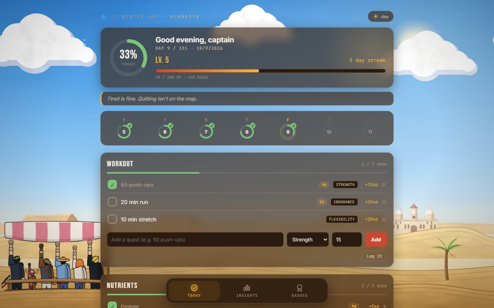
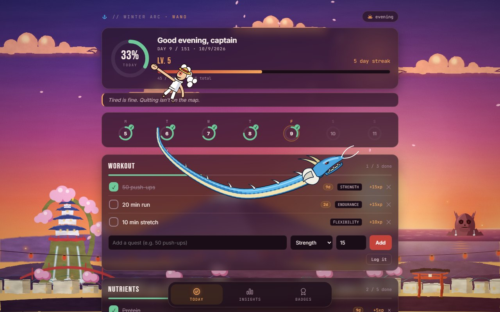
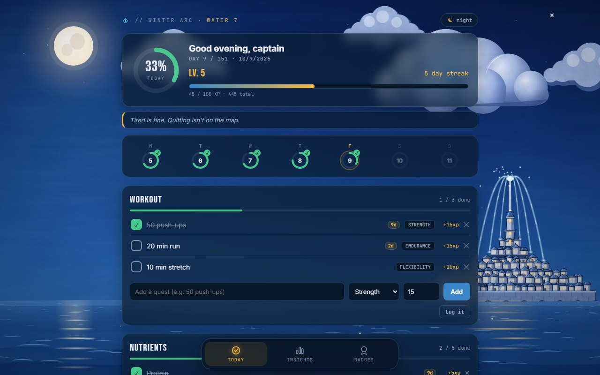
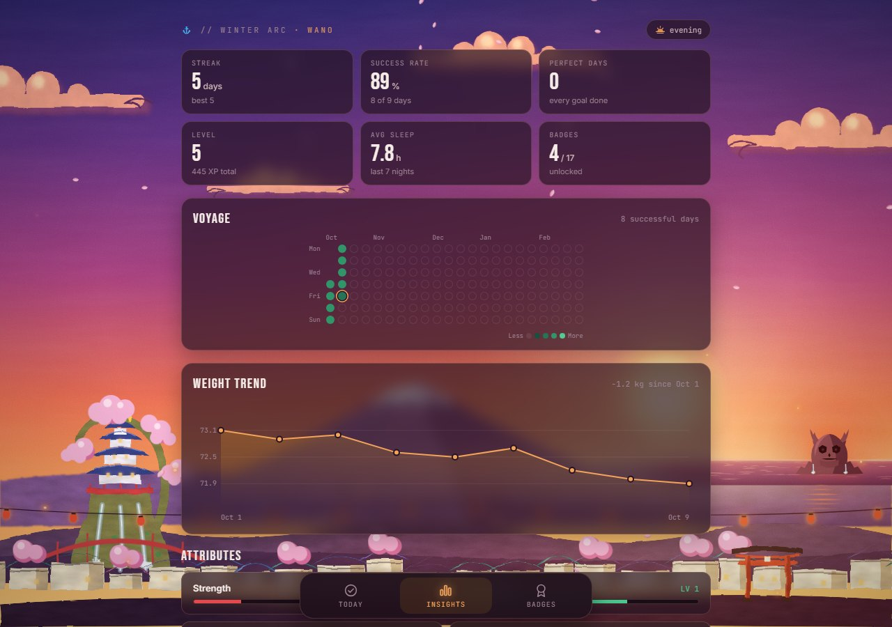
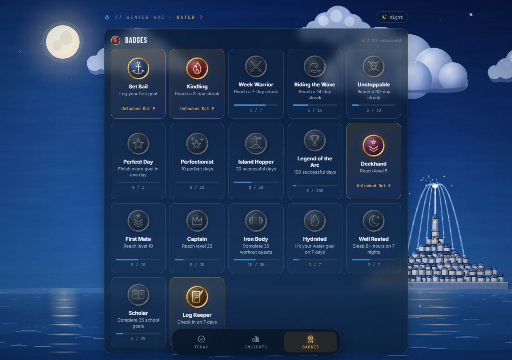
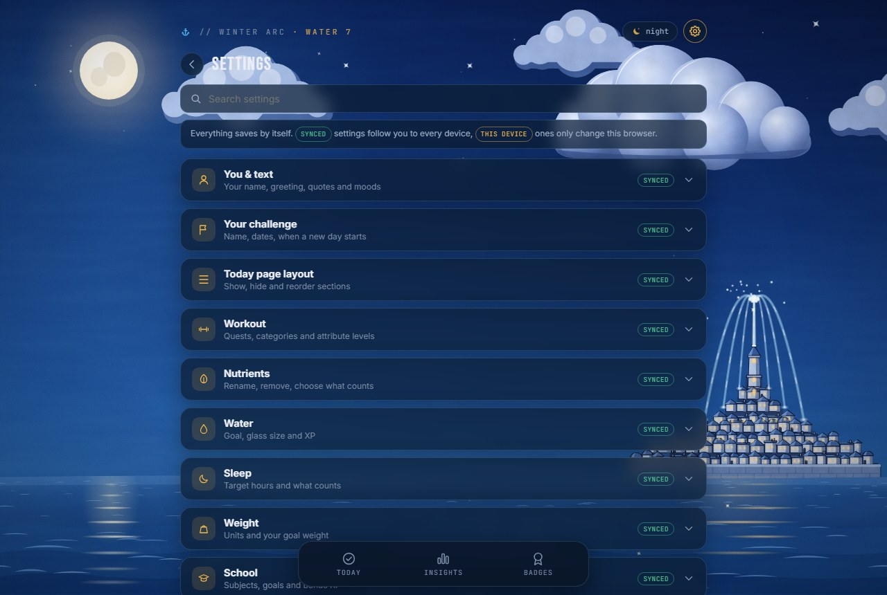
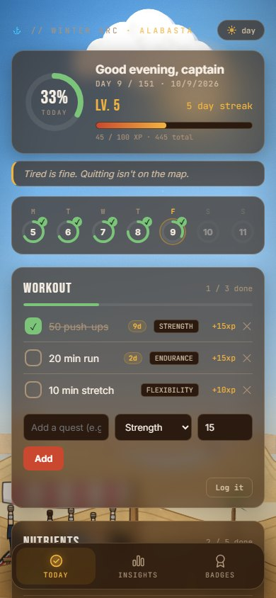
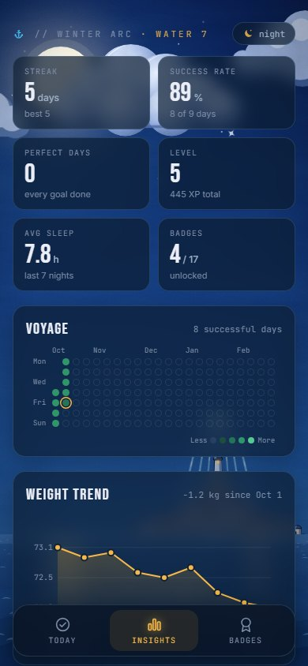
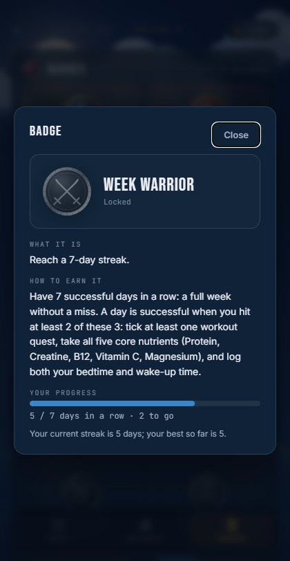
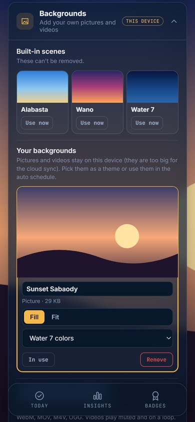

# Winter Arc Training Log ⚓

I made this to keep myself on track during my winter arc (Oct 1 to Feb 28). It's a habit tracker where I log my workouts, supplements, water, sleep, weight and school stuff every day, and it gives me XP, streaks and badges so I actually stick with it. And because I'm a huge One Piece fan, the whole background is an anime scene that changes throughout the day.

**Try it here: [vyush-ux.github.io/training-log](https://vyush-ux.github.io/training-log/)**



## What it does

**Today tab**
- A ring at the top that fills up as I finish my goals for the day (and throws confetti when it hits 100%)
- A week strip so I can see how my week is going. Tapping a day shows what I logged that day
- Workouts sorted into strength, endurance, speed and flexibility, each worth its own XP
- Nutrients and supplements. There are 5 by default and you can add your own
- Water, where you just tap the glasses as you drink
- Sleep. You put in when you went to bed and woke up and it tells you if you got 8 hours
- Weight, plus how much it changed since last time
- School goals split into subjects. Finishing a whole subject gives bonus XP
- A quick check-in where you pick your mood and write a line about your day
- Little streak counters (like `9d`) next to anything you've done a few days in a row
- A log history with everything from every day
- You can long-press the greeting or the quote at the top to write your own. Hold it, let go, type, press Enter. If you delete the text it goes back to the normal one

**Insights tab**
- My streak, best streak, success rate, perfect days, level and average sleep
- Voyage, which is a dot for every day of the arc. The brighter the dot, the more I got done that day
- A weight chart
- Levels for strength, endurance, speed and flexibility

**Badges tab**
- 17 badges to unlock. Tap one to see exactly what you need to do for it and how close you are

**Settings**

The gear in the top right opens Settings, and you can change pretty much everything in there:
- Your name in the greeting, your own list of quotes and what the mood buttons say
- The challenge itself: its name, start and end date, what time a new day starts (handy if you log stuff after midnight), Monday or Sunday weeks and how dates look
- Which cards show up on the Today page and in what order
- Your quests, the category names and colors, and which nutrients you have and which ones count
- Water goal and glass size, your sleep target, kg or lb (old weigh-ins get converted, nothing gets lost) and a goal weight that shows up on the chart
- How much XP everything gives, how much a level takes, what counts as a successful or perfect day and what each badge needs
- The theme schedule, how much the background moves, darker background, see-through cards, your own accent color, text size, confetti, sound, vibration and the +XP pop-ups
- Your own backgrounds. Add pictures or videos (JPG, PNG, GIF, WebP, AVIF, MP4, WebM, MOV and more) and use them just like the built-in scenes, even in the schedule
- Your own app icon and name. Pick any picture, drag and zoom it until it looks right, and it becomes the icon in your browser tab and on your home screen. (Phones only grab the icon when you add the app, so if it's already on your home screen, remove it and add it again)
- Your own roar. Record yourself (or grab any clip up to a minute long), add it as MP3, WAV, M4A or whatever, and that's what plays when Onigashima wakes up. If you add a few, it can pick a random one each time
- Backups you can export and import again, plus resets for just today, just XP and badges, or everything

Most settings are saved in your log, so they follow you to every device. The look, sound and background stuff only changes the device you're on, and your background, sound and icon files stay on that device because they'd be way too big for the sync.

It works on my phone and my laptop and syncs between them with a sync code.

## The backgrounds

| Theme | When it shows up | What's in it |
|---|---|---|
| ☀︎ Alabasta | 6:00 to 17:00 | The desert, the palace far away on the horizon, and the crew doing the X salute on the ship |
| ◒ Wano | 17:00 to 18:00 | Sunset over the Flower Capital, falling sakura, lanterns, and Onigashima glowing red out at sea |
| ☾ Water 7 | 18:00 to 6:00 | The fountain city at night with the sea train going past |

You can also just pick one with the theme button in the top right if you don't want it to switch by itself. In Settings you can change the times or add your own pictures and videos as backgrounds.

Little secret: in Wano, click on Onigashima (on your phone tap "· wano" at the top). Turn your sound on for this one. You can swap the roar for your own sound in Settings → Sound & feel.

## Screenshots

| Wano (with the secret) | Water 7 |
|---|---|
|  |  |

| Insights | Badges |
|---|---|
|  |  |

| Settings |
|---|
|  |

| On my phone | Insights on my phone | Badge info | My own background |
|---|---|---|---|
|  |  |  |  |

*These use test data, not my real logs.*

## How to use it

1. Open the link up top
2. The first time, press "Create a new sync code" and save that code somewhere. On your other devices you just type in the same code
3. Tick stuff off during the day. It saves by itself
4. On your phone you can do "Add to Home Screen" so it opens like a normal app

## How the points work

These are the defaults. You can change all of it in Settings → XP, levels & rules.

- Every 100 XP is a level up
- Workouts and school goals give the XP shown next to them, and finishing a whole subject gives its bonus. Nutrients, hitting your water goal, sleeping 8+ hours, logging your weight and doing the check-in are 5 XP each
- A day counts as successful if you do at least 2 of these 3: one workout, all 5 main nutrients, and logging your sleep. Successful days in a row are your streak
- A perfect day is when you finish literally everything on the Today page
- Once a day is over it's locked, so no going back and cheating 😅

## About the sync code

Your data gets saved in Firebase under your sync code. Anyone who has your code can see and change your log, so don't share it with anyone. The app also keeps a copy on your device, so it still works without internet and uploads everything once you're back online. "Reset all progress" at the very bottom deletes your progress but keeps your settings. Settings → Sync & data has a backup export and more reset options.

## Running your own

Everything is in one file, `index.html`. You don't need to install anything.

To try it on your computer:

```bash
python -m http.server 8000
```

and then open `http://localhost:8000`.

If you fork it, please use your own Firebase so you're not saving into mine:

1. Make a project on [Firebase](https://console.firebase.google.com), add a web app and turn on Firestore
2. Swap the `firebaseConfig` near the top of `index.html` with yours. These values aren't secret, the Firestore rules are what actually protect the data
3. Rules like these work fine:

```
rules_version = '2';
service cloud.firestore {
  match /databases/{database}/documents {
    match /trainingLogs/{code} {
      allow read, write: if code.size() >= 6;
    }
  }
}
```

Then push it to GitHub and turn on Pages (Settings → Pages → deploy from the `main` branch).

## How it's made

It's just HTML, CSS and JavaScript in one file, plus Firebase for the syncing. All the scenery, characters, badges and charts are drawn in SVG and animated with CSS, so there are no images in it except the app icon. If you add your own backgrounds or roar sounds, they get saved in your browser's storage (IndexedDB) on that device. The Onigashima sound is made right in the browser with the Web Audio API. If your phone or computer has "reduce motion" turned on, the animations switch off.

```
training-log/
├── index.html           # the whole app
├── README.md
└── docs/
    └── screenshots/     # the pictures in this readme
```

## Disclaimer

This is just a fan project I made for myself, not for money. One Piece and everything from it belongs to Eiichiro Oda, Shueisha and Toei Animation, and I'm not connected to them in any way. The scenes in the app were drawn from scratch for this project, inspired by the anime's style. The app icon is fan art and belongs to whoever made it.
